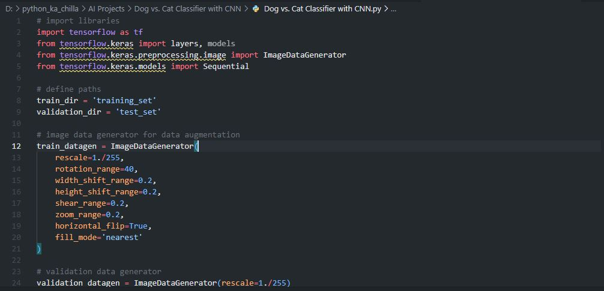
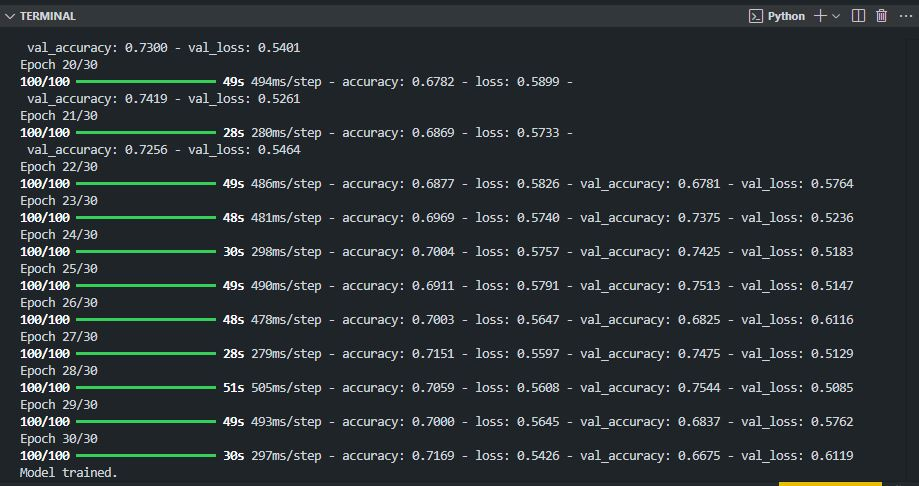
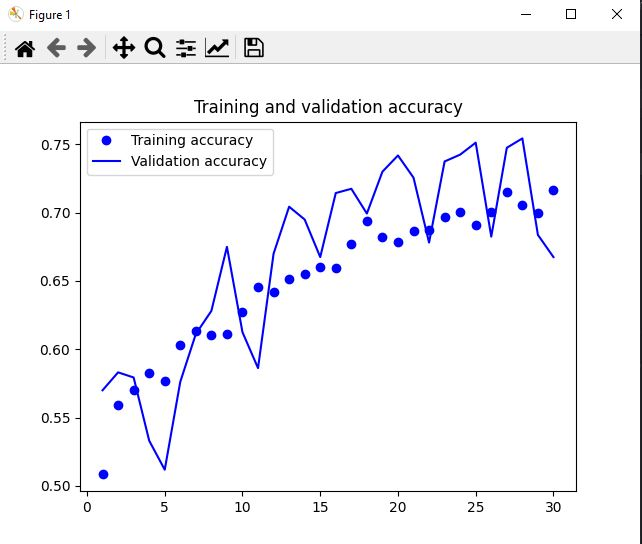
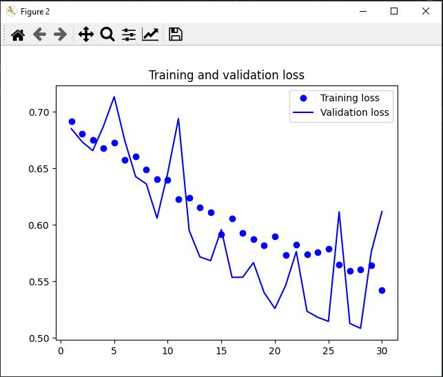

# 🐶🐱 Dog vs. Cat Classifier with CNN 🤖  
     

<p align="center">
  
</p>

🚀 This project builds a **Convolutional Neural Network (CNN)** using TensorFlow/Keras to classify images of dogs and cats. It demonstrates data augmentation, model training, evaluation, and prediction on new images. The dataset is the classic [Dogs vs. Cats](https://www.kaggle.com/c/dogs-vs-cats) dataset from Kaggle.

---

## ✨ Key Features  
📸 **Image Classification** – Distinguishes between dogs and cats  
🔄 **Data Augmentation** – Applies random transformations to improve generalization  
🧠 **CNN Architecture** – Multiple convolutional and pooling layers  
📊 **Training & Validation** – Tracks accuracy and loss over epochs  
📈 **Visualization** – Plots training/validation accuracy and loss  
🔮 **Prediction on New Images** – Load and classify any dog/cat photo  

---

## 🧠 Tech Stack  
- **Language:** Python 🐍  
- **Framework:** TensorFlow / Keras  
- **Libraries:** Matplotlib, NumPy  
- **Techniques:** Data Augmentation, Convolutional Neural Networks  
- **Recommended IDE:** VS Code / PyCharm 💻  

---

## 📦 Installation  

```bash
git clone https://github.com/SayabArshad/Dog-Cat-Classifier-CNN.git
cd Dog-Cat-Classifier-CNN
pip install tensorflow matplotlib numpy
````
⚙️ Note: You need to download the dataset from Kaggle and organize it into training_set/ (with subfolders dogs and cats) and test_set/ similarly.

---

## ▶️ Usage

Run the main script:

```bash
python "Dog vs. Cat Classifier with CNN.py"
```

The script will:

Load and augment training/validation images.

Build and compile the CNN model.

Train the model for 30 epochs.

Display training/validation accuracy and loss plots.

(Optional) Predict a new image using the trained model.

---

## 📁 Project Structure

```
Dog-Cat-Classifier-CNN/
│-- Dog vs. Cat Classifier with CNN.py                                            
│-- README.md                                     
│-- assets/                                      
│    ├── code.JPG
│    ├── terminal.JPG
│    ├── accracy plot.JPG
│    └── loss plot.JPG
```
---

## 🖼️ Interface Previews

| 📝 Code Snippet | 📊 Console Output |
|:---------------:|:-----------------:|
|  |  |

| 📈 Training & Validation Accuracy | 📉 Training & Validation Loss |
|:--------------------------------:|:----------------------------:|
|  |  |

---

## 💡 About the Project

This project implements a CNN from scratch using TensorFlow/Keras to solve the classic Dogs vs. Cats image classification problem. The model consists of four convolutional layers with max pooling, followed by a dense layer and a sigmoid output for binary classification. Data augmentation (rotation, shifting, zoom, flip) helps prevent overfitting. The training logs show the model achieving around 75% validation accuracy after 30 epochs. The script also includes a function to predict on any new image – a practical step toward real‑world deployment.

---

## 🧑‍💻 Author

**Developed by:** [Sayab Arshad Soduzai](https://github.com/SayabArshad) 👨‍💻

📅 **Version:** 1.0.0

📜 **License:** MIT License

---

## ⭐ Contributions

Contributions are welcome! Fork the repository, open issues, or submit pull requests to enhance functionality (e.g., fine‑tuning, using pretrained models, building a web app).
If you find this project helpful, please ⭐ star the repository to show your support.

---

## 📧 Contact

For queries, collaborations, or feedback, reach out at **[sayabarshad789@gmail.com](mailto:sayabarshad789@gmail.com)**


---

🐾 Teaching machines to tell cats and dogs apart.

---
